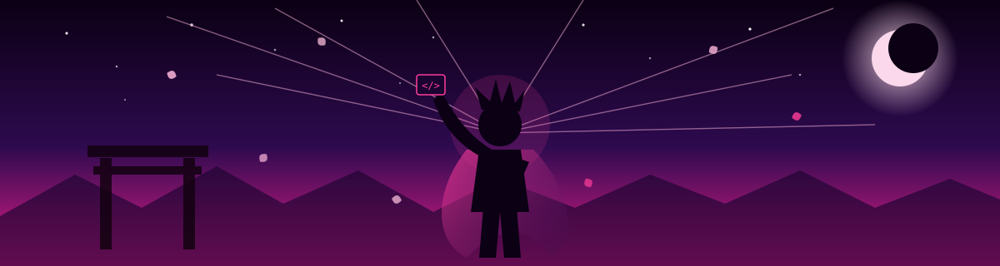
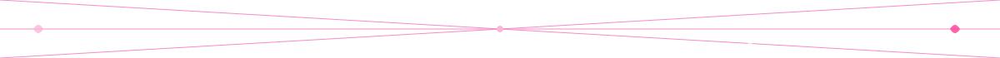
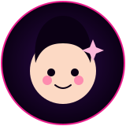
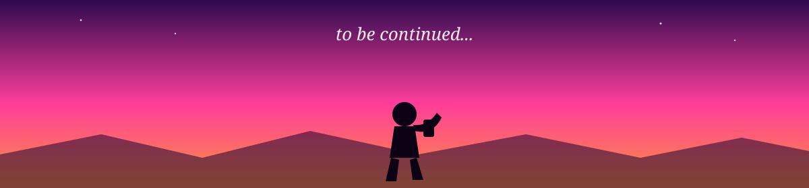

 

## 📜 &nbsp;Character File

<table>
<tr>
<td width="18%" valign="top" align="center">

</td>
<td width="40%" valign="top">

### 「 Shahmeer Ali 」— Class: Full-Stack Mage 🧙

Every good series starts the same way: an ordinary student discovers a power they didn't know they had. Mine turned out to be **turning ideas into software that actually ships** — not prototypes that vanish into a folder like a filler arc nobody watches.

**Flutter** is my home village — the place I trained first and still return to. From there my journey arcs outward into **AI engineering**, **backend systems**, and the kind of **system design** that keeps a product alive past the pilot episode.

 

  

<b>🎴 Character backstory (click to expand)</b>

 

I don't collect every technique in the tournament — I master one style, go deep, and only learn a new jutsu when it solves a real fight. Right now that means: Flutter for interfaces people actually enjoy touching, and AI agents for the parts of an app that shouldn't need a human standing over it.

</td>
<td width="42%" valign="top">

<table>
<tr>
<td width="50%" valign="top">

> 🟢 **STATUS EFFECT**
> Open to new builds

</td>
<td width="50%" valign="top">

> 📍 **HOME VILLAGE**
> Pakistan

</td>
</tr>
<tr>
<td width="50%" valign="top">

> ⚔️ **MAIN CLASS**
> Flutter / Dart

</td>
<td width="50%" valign="top">

> 🌀 **AWAKENING**
> AI Agents & RAG

</td>
</tr>
</table>

 

> 💬 *"The strongest code isn't the one that never breaks — it's the one someone bothers to fix."*

</td>
</tr>
</table>

## ⚔️ &nbsp;Battle Style — What I Build

<table>
<tr>
<td width="33%" valign="top" align="center">

  

**Flutter · Dart · Firebase**

Interfaces with clean footwork — fast, intentional, built to be used, not just demoed for the judges.

</td>
<td width="33%" valign="top" align="center">

  

**Node.js · Express · PostgreSQL**

The support class holding the party together — APIs built around how the app is actually used.

</td>
<td width="33%" valign="top" align="center">

  

**Python · LangChain · LangGraph**

The forbidden technique — figuring out where AI genuinely levels up a product, and where it's just genjutsu.

</td>
</tr>
</table>

 

THE ARC EVERY PROJECT GOES THROUGH

  

<code>IDEA</code> → <code>UNDERSTAND</code> → <code>DESIGN</code> → <code>BUILD</code> → <code>TEST</code> → <code>SHIP</code> → <code>NEXT ARC ↺</code>

## 🌸 &nbsp;Skill Tree

<table>
<tr>
<td width="50%" valign="top">

  

  

`Dart` `Python` `JavaScript` `Kotlin` `Java` `C++`

</td>
<td width="50%" valign="top">

  

  

`Flutter` `Android` `Firebase`

</td>
</tr>
<tr>
<td width="50%" valign="top">

  

  

`Node.js` `Express` `PostgreSQL` `MongoDB` `Supabase`

</td>
<td width="50%" valign="top">

  

  

`LangChain` `LangGraph` `RAG` `AI Agents` `MCP`

</td>
</tr>
<tr>
<td colspan="2" align="center">

  

</td>
</tr>
</table>

## 📊 &nbsp;Battle Record

 

 

<table>
<tr>
<td width="34%" valign="top">

</td>
<td width="33%" valign="top">

</td>
<td width="33%" valign="top">

</td>
</tr>
</table>

### 📡 Training Log (Contribution Snake)

## 🔥 &nbsp;Training Arc — Currently Exploring

<table>
<tr>
<td width="33%" valign="top">

<b>🤖 AI Agents</b>

 

Summoned constructs that can reason, call tools, and actually finish a quest — not just answer one riddle and vanish.

`Agents` `Tool Calling` `Workflows`

</td>
<td width="33%" valign="top">

<b>📚 RAG</b>

 

Linking a spellcaster to the real, living archive — so answers are grounded instead of conjured from thin air.

`Embeddings` `Retrieval` `Vector Search`

</td>
<td width="33%" valign="top">

<b>🔌 MCP</b>

 

One scroll that lets any AI plug into any tool — instead of forging a new key for every single door.

`Tools` `Context` `Integrations`

</td>
</tr>
</table>

 

<blockquote>
<h3>01 · BUILD</h3>
Start with something real, not a scroll of theory.
</blockquote>

<blockquote>
<h3>02 · LEARN</h3>
Understand why the technique actually works.
</blockquote>

<blockquote>
<h3>03 · ITERATE</h3>
Come back stronger than the last arc.
</blockquote>

## 🏆 &nbsp;Achievements Unlocked

 

 
a random one-liner respawns every visit — a filler episode for making it this far ⤴

## 🏮 &nbsp;Guild Hall — Contact

  

  

<a href="#top">↑ back to episode start</a>

  

